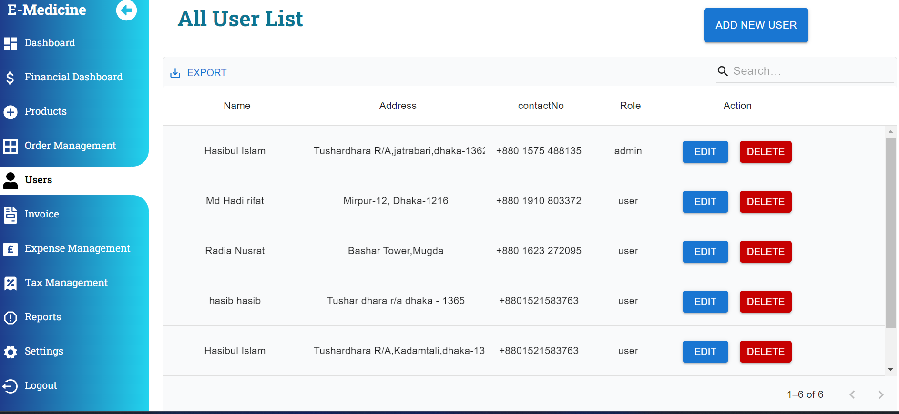
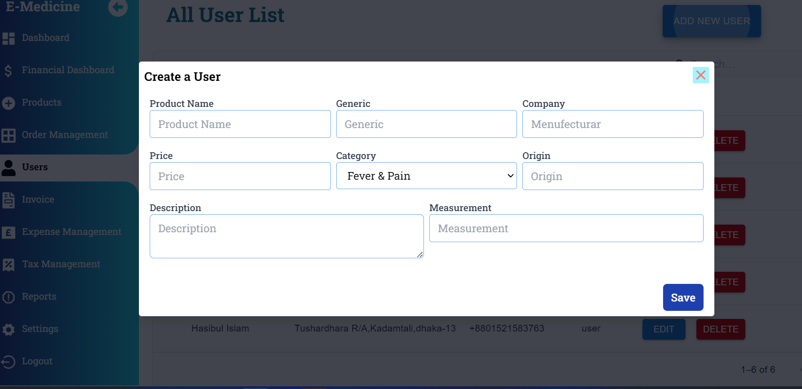

# Healthcare Platform

Welcome to our Healthcare Platform! This platform provides a comprehensive set of features to cater to all your medical needs, from ordering medicines to seeking professional medical advice.

# Live Link 
  ### Client Site Credentials --> email :  demo@gmail.com  || pass : 110220
  ### Client Site : ecare-client007.vercel.app
  ### Admin Site : https://ecare-admin007.vercel.app/

## Technologies Used
- Language : JavaScript, TypeScript, HTML
- Frontend [Admin] : React, Meterial UI, Tailwind CSS, etc
- Frontend [Client] : NextJs, Meterial UI, Tailwind CSS, Framer Motion, etc
- Backend: ExpressJS, Mongoose, JWT, Zod, etc
- Database: MongoDB
- Deployment: Vercel

  

# SnapShort 
  ## Client Site
  

  ## Dashboard HomePage Show OverAll App Data

  ## Financial Dashboard Show All Sales Data 

  ## Product Management

  ## User Management

  ### Order Management
  
  
  

## Features
### User Authentication and Authorization
- Secure user registration and login functionality.
- Role-based access control for different user types (e.g., customers, admins).

### Product Catalog
- Comprehensive listing of available medicines and medical supplies.
- Categorization and filtering options for easy browsing.

### Shopping Cart
- Ability to add medicines to a cart for purchasing.
- Seamless checkout process with multiple payment options.

### Prescription Management
- Option for users to upload and manage their prescriptions securely.
- Integration with pharmacy systems for prescription verification.

### Order Tracking
- Real-time tracking of order status and delivery updates.
- Notification alerts for order confirmation, shipping, and delivery.

### Health Information Hub
- Access to reliable health information and resources.
- Educational materials about medicines and health conditions.

### Consultation Services
- Virtual consultation with healthcare professionals.
- Appointment scheduling and management.

### Community Support
- Discussion forums for users to share experiences and ask questions.
- Peer-to-peer support network for health-related inquiries.

### Notifications and Alerts
- Customizable notifications for promotions, discounts, and new arrivals.
- Alerts for medication refills and reminders for health check-ups.

### Responsive Design
- Mobile-friendly interface for seamless access on various devices.
- Responsive layout for optimal viewing and navigation.

## Contact Info
  ### Email: hasibul.dcc@gmail.com
  ### Client Site : https://e-medicine007.vercel.app/
  ### Admin Site : https://emedecine-admin.vercel.app/
  ### GitHub: https://github.com/hasibul1670

